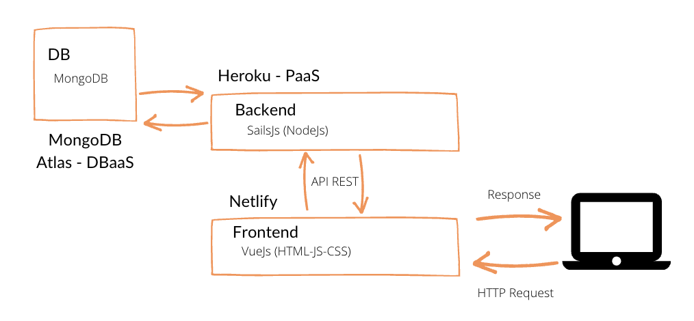

# 🐰 bunny-app
This fullstack project consists in a To-do web app and two sets of REST API endpoints

### ✨Deployed project✨

Client - [bunny-app.netlify.app](https://bunny-app.netlify.app/)

Server - [bunny-app.herokuapp.com](https://bunny-app.herokuapp.com)

### 🖥 Front Frameworks & libraries
The front "app" is structured in one main view "Home" that contains a "Header", "UserList" and "TaskList" components. UserList and TaskList contain the components "UserCard" and "TaskCard" to render individual users and tasks.

* VueJs
* Bootstrap-vue
* SCSS
* Pug
* Axios
* Vuex

### 💻 Back Frameworks & libraries
The back "api" is structured in controllers for handling the requests for the DB and models for creating the data schema. Routing and db connection is in the file routes.js and datastore.js

* SailsJs
* mongo-sanitize

### 💾 DB
There is one main DB called "Bunny" with two collections "Task" and "User"

* MongoDB

### 📌 Arquitecture



### 🔧 Setup Front

Install dependencies
```yarn install```

Run local
```yarn serve```

### ⚙️ Setup Back
__MongoDB must be installed and started__

Install dependencies
```npm install```

Create .env with the following info 
```PROJECT_NAME="bunny"
NODE_ENV="development"

# Sails

PORT=1337

# MongoDB

export MAIN_DB_ADAPTER="sails-mongo"
export MAIN_DB_HOST="localhost"
export MAIN_DB_PORT="27017"
export MAIN_DB_USER=""
export MAIN_DB_PASSWORD=""
export MAIN_DB_DB="bunny"
```

Add .env variables 
```source .env```

```source .env```
Lift local server
```sails lift``` or ```node app.js```
```source .env```


